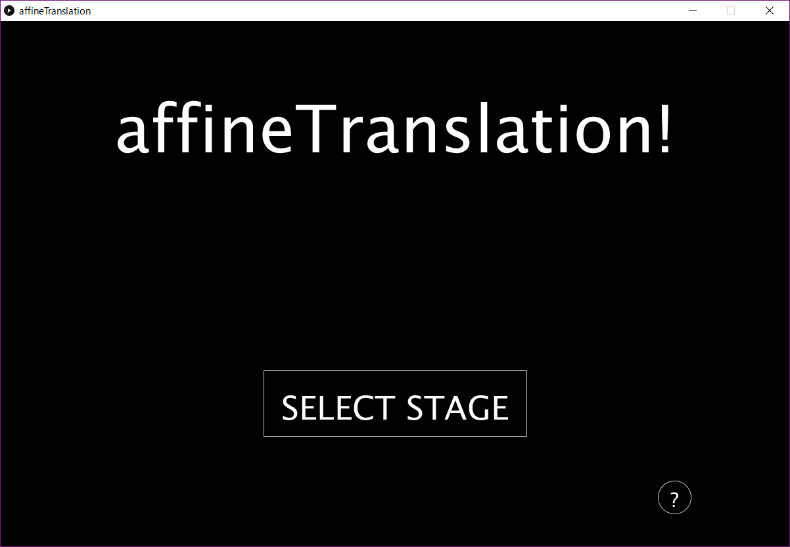
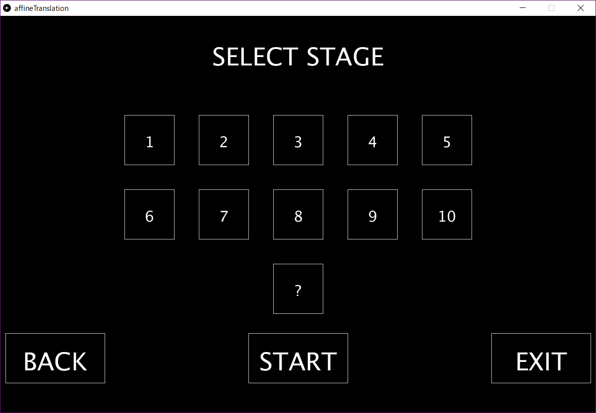
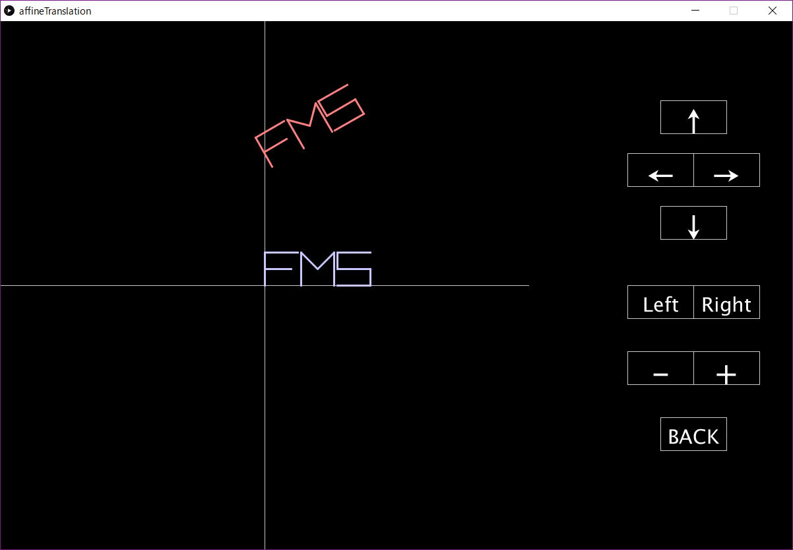

# affineTranslation
図形を目的の位置や形、大きさに調節し素早く近づけるゲーム

(別名:アフィン変換を用いたパズルゲーム)

## 言語
- [Processing - 3.3](https://processing.org/)

## 起動
[Processing](https://processing.org/)をダウンロードし、.pdfファイルを開き、▶をクリックすると起動できます。

## 遊び方

### 起動画面

### ステージ選択画面
ステージは"10"ほど難しくなります。"?"は初期位置が完全ランダムなステージで遊ぶことが出来ます。

### プレイ画面
"↑","↓","→","←"や"Left","Right","+","-"を操作することで赤色のFMSを青色のFMSに近づければステージクリアです。

